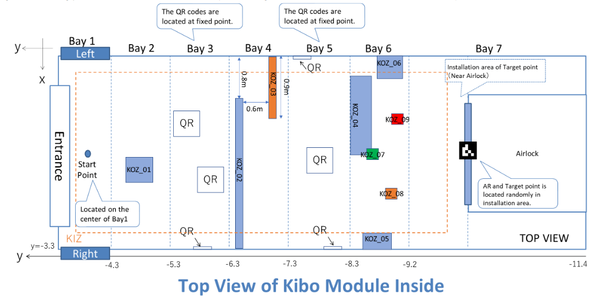
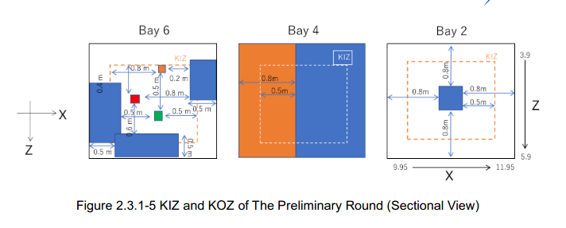

## Progress Kibo
1. `BELUM` Setup virtual server linux untuk simulasi. **(Target selesai: 23 Mei 2020)**
2. `BELUM` Install software simulator & android studio di virtual server. **(Target selesai: 23 Mei 2020)**
3. `PROSES` Buat program:
    - `PROSES` Program untuk memindahkan Astrobee ke titik tertentu hingga ke target point.
    - `BELUM` Program untuk menscan/membaca QR CODE.
    - `BELUM` Program untuk menscan/membaca AR TAG.
    - `BELUM` Program untuk mengarahkan laser ke target point.
    - `BELUM` Program untuk menghindari rintangan / obstacle **(Keep-Out Zone)**.
    - dll, menyusul
4. **DEBUGGING, DEBUGGING, AND DEBUGGING.**
5. `BELUM` Upload APK ke web simulator. **DEADLINE Rabu, 10 Juni 2020 pukul 23.59 WIB**.
6. `BELUM` Upload video profil. **DEADLINE Jumat, 12 Juni 2020 pukul 11.00 WIB**.
    
## Catatan
1. Preliminary Round akan diadakan secara online pada **Sabtu, 13 Juni 2020 pukul 09.00 WIB**.
2. Astrobee tidak dapat bergerak di area **Keep-Out Zone (KOZ)**.
3. Posisi awal Astrobee:
    + Position (x, y, z) = (10.95, -3.75, 4.85)
    + Orientation (x, y, z, w) = (0, 0, 0.707, -0.707)
4. Didekat target point ada AR Tag. Posisi **TARGET POINT** dan **AR TAG** random, selain yang disebutkan posisinya **TETAP**.
5. Tabel untuk posisi QR CODE.

No. | Position (x, y, z) | Orientation (x, y, z, w)
--- | --- | ---
P1-1 | (11.5, -5.7, 4.5) | (0, 0, 0, 1)
P1-2 | (11, -6, 5.55) | (0, -0.7071068, 0, 0.7071068)
P1-3 | (11, -5.5, 4.33) | (0, 0.7071068, 0, 0.7071068)
P2-1 | (10.30, -7.5, 4.7) | (0, 0, 1, 0)
P2-2 | (11.5, -8, 5) | (0, 0, 0, 1)
P2-3 | (11, -7.7, 5.55) | (0, -0.7071068, 0, 0.7071068)

6. Tabel untuk letak rintangan / obstacle **(Keep-Out Zone)**.

KOZ | x_min | y_min | z_min | x_max | y_max | z_max
--- | --- | --- | --- | --- | --- | ---
01 | 10.75 | -4.9 | 4.8 | 10.95 | -4.7 | 5.0
02 | 10.75 | -6.5 | 3.9 | 11.95 | -6.4 | 5.9
03 | 9.95 | -7.2 | 3.9 | 10.85 | -7.1 | 5.9
04 | 10.10 | -8.6 | 5.4 | 11.1 | -8.3 | 5.9
05 | 11.45 | -9.0 | 4.1 | 11.95 | -8.5 | 5.1
06 | 9.95 | -9.1 | 4.6 | 10.45 | -8.6 | 5.6
07 | 10.95 | -8.4 | 4.9 | 11.15 | -8.2 | 5.1
08 | 11.05 | -8.9 | 4.2 | 11.25 | -8.7 | 4.4
09 | 10.45 | -9.1 | 4.6 | 10.65 | -8.9 | 4.8

7. Tabel untuk letak Ruang Kibo **(Keep-In Zone)**.

KIZ | x_min | y_min | z_min | x_max | y_max | z_max
--- | --- | --- | --- | --- | --- | ---
`#` | 10.25 | -9.75 | 4.2 | 11.65 | -3 | 5.6

## Gambar-gambar

  

  
